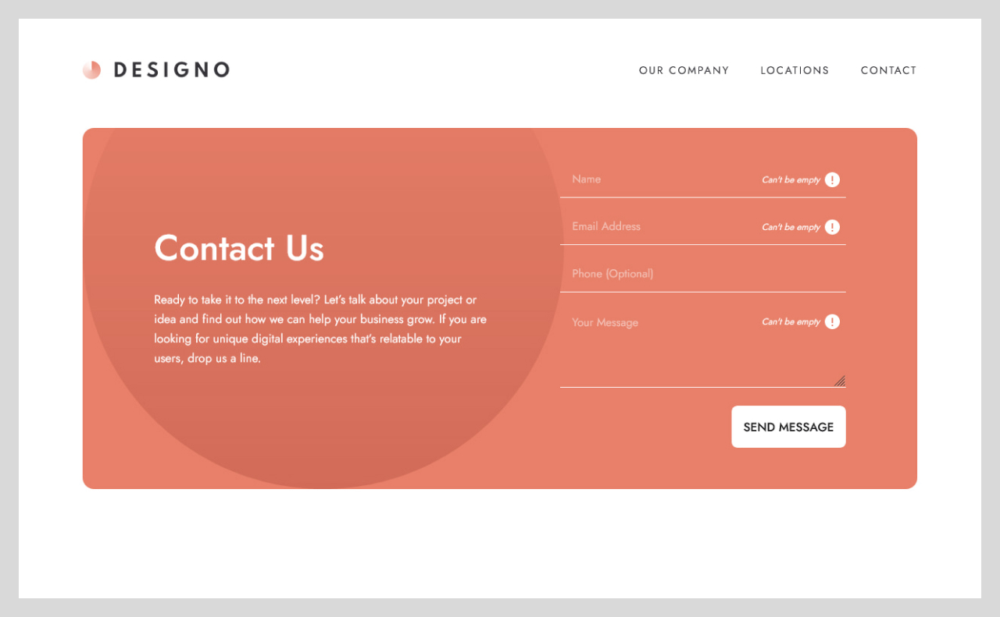

# Designo Agency Website

## About The Project
Lorem ipsum dolor sit amet, consectetur [Designo agency website challenge on Frontend Mentor](https://www.frontendmentor.io/challenges/designo-multipage-website-G48K6rfUT). adipiscing elit, sed do eiusmod tempor incididunt ut labore et dolore magna aliqua. Ut enim ad minim veniam, quis nostrud exercitation ullamco laboris nisi ut aliquip ex ea commodo consequat. Duis aute irure dolor in reprehenderit in voluptate velit esse cillum dolore eu fugiat nulla pariatur. Excepteur sint occaecat cupidatat non proident, sunt in culpa qui officia deserunt mollit anim id est laborum.

## View The Project
- [View Website](https://zz83.github.io/designo-multi-page-website/)

## Built With
   

## Tools Used
   

    

## How I Organized the Project
One of the challenges I faced when working on this project was how do I organize my CSS. To help me solve this problem, I researched different CSS methodologies by reading articles and watching informative videos. I ultimately decided on an approach that mixes [ABEM](https://imarc-boilerplate.netlify.app/pattern-library/docs/abem.html) with [ITCSS](https://www.xfive.co/blog/itcss-scalable-maintainable-css-architecture/) and my own personal preference.

## Form
When submitting the contact form, an error message, "Can't be empty," will be displayed if any of the required form fields are left empty.

                